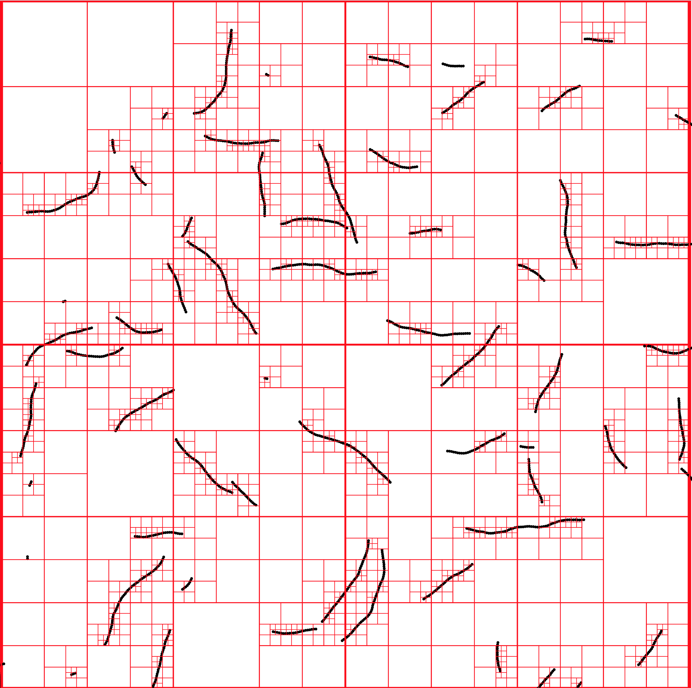

# 500-player snake

This project was a successful attempt to simulate 500-player games of snake in real-time. I knew this was possible from the existence of http://slither.io, but I did not know how to perform real-time collision detection with 500,000+ circles in one continuous world.

My previous games and simulations have all used a regular grid. I don't want them to be so un-real but I've struggled to move beyond that. I've been curious about [space partitioning](https://en.wikipedia.org/wiki/Space_partitioning) datastructures for a long time and I correctly assumed I could learn from them.

I have used a [Quadtree](https://en.wikipedia.org/wiki/Quadtree) to speed up collision detection. This space partitioning datastructure is completely recomputed every time the snakes move. The commit messages explain much of my reasoning along the way.



## Usage

Requires Go. Developed with `go1.11.5`.

Run the simulator:

```
go run main.go
```

This is a technology demonstrator. You can run it with `go run main.go`. It plays a random game of snake with hundreds of thousands of circles, periodically outputting very large SVG files which can be opened and reloaded in (e.g.) Chrome.
